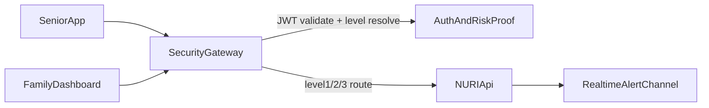

# Security Gate Layer Draft

## Goal

Align runtime architecture with the business plan by introducing a dedicated Spring Cloud Gateway layer that enforces risk-level routing and authentication policy before requests enter the API service.

## Target Topology

## Routing Policy

- `level1`: read/analyze/recommend endpoints; JWT required.
- `level2`: requires valid short-lived risk proof (`X-Risk-Proof`) signed by server.
- `level3`: requires WebAuthn verification completion and level3 risk proof.

## Suggested Components

- Gateway filters
  - `JwtValidationFilter`
  - `RiskLevelPolicyFilter`
  - `RiskProofVerificationFilter`
- API service
  - Keeps domain logic and transfer assertions
  - Exposes risk-proof issuing endpoints after trusted checks
- Shared contracts
  - `RiskLevel` enum
  - error code mapping for blocked requests

## Migration Steps

1. Introduce gateway module and copy current level policy from interceptor.
2. Switch clients to gateway URL and keep interceptor in monitor mode temporarily.
3. Remove duplicated policy checks from API interceptor after stabilization.
4. Add dashboard/alert latency and blocked-request metrics at gateway.
